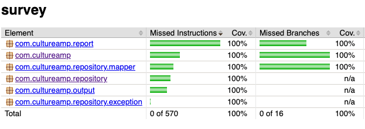

# culture-amp-survey

## Design thoughts

* Reading a survey from input source and display a report in console as output
* Application is composed of multiple layers
    * input - file
    * report - formatted output
    * output console

High level design diagram for your reference   

* `ReportFactory` is responsible for instantiating dependencies and return report object
* `ParticipationReport` is responsible for Total participation count and average response
* `SurveyRatingReport` is responsible for average rating for specific question
* All the repository has interface `SurveyRepository`, so that it is extensible to fetch data from different sources
* output is displayed in console, so `ConsoleOutput` has interface `Output` which opens up opportunities to use
  different output channel
* Exception are thrown from different layers, which are handled in App level to display relevant error message.

## Assumptions

* input file name
    * single program argument - input survey question file name is sufficient to derive response file name by
      adding `-responses` suffix
    * two program arguments - first one for question and second one for response
* if the rating type is `singleselect` currently average operation is ignored as I'm not sure what is the criteria to
  calculate average on string

```
ex.
survey-1.csv
survey-1-responses.csv
```

---

## Prerequisite

maven 3.6.3 Jdk 15

---

## How to use?

### Run test

> mvn clean verify

### Coverage report

Code coverage report is available in
> target/site/jacoco/index.html

_Note:_ Report is only available after running test.



_Note:_ Coverage report for entity and dto are excluded

---

### Run Application

#### Without arguments

if maven and java15 are available in machine
> mvn compile exec:java -Dexec.mainClass="com.cultureamp.App"

otherwise (using docker)
<blockquote>
docker run -v "$PWD:/home" -w /home -it maven:3.6.3-adoptopenjdk-15 bash

mvn compile exec:java -Dexec.mainClass="com.cultureamp.App"
</blockquote>

#### With arguments

if maven and java15 are available in machine
> mvn compile exec:java -Dexec.mainClass="com.cultureamp.App" -Dexec.args="/coding-test-application/example-data/survey-2.csv"

otherwise (using docker)
<blockquote>
docker run -v "$PWD:/home" -w /home -it maven:3.6.3-adoptopenjdk-15 bash

mvn compile exec:java -Dexec.mainClass="com.cultureamp.App" -Dexec.args="
/coding-test-application/example-data/survey-2.csv"
</blockquote>

## Quality

### Findbugs

`mvn findbugs:gui`

### checkstyle

`mvn checkstyle::check`

### pmd

`mvn pmd::pmd`

---

### Practices

Had pre-commit git hook which run `mvn clean verify` before pushing so every push ensure better quality code

Used `jacoco` code coverage tool to fail build when code coverage is compromised
